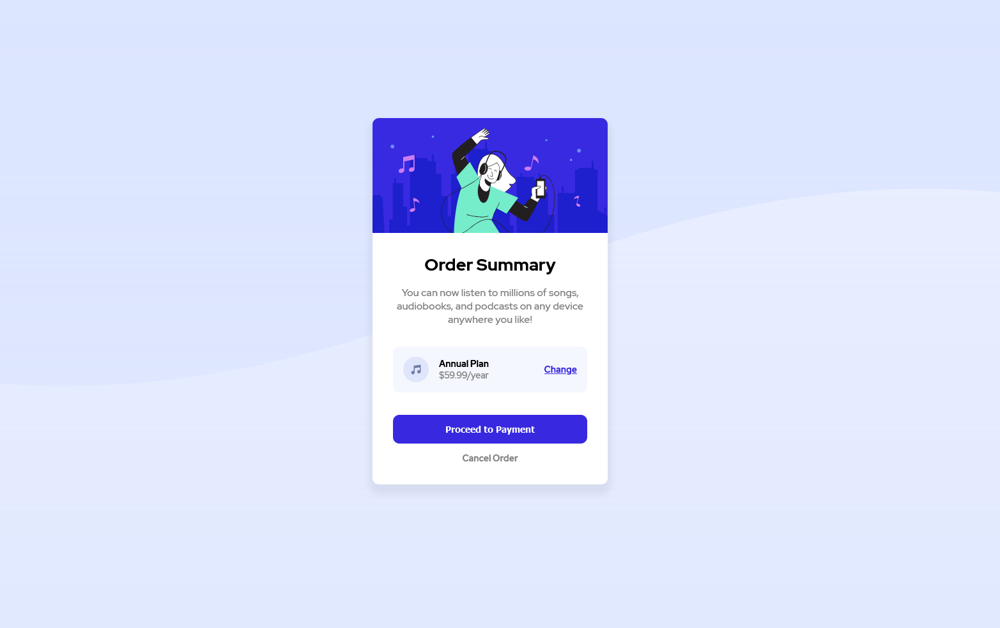

# Frontend Mentor - Order summary card solution

This is a solution to the [Order summary card challenge on Frontend Mentor](https://www.frontendmentor.io/challenges/order-summary-component-QlPmajDUj). Frontend Mentor challenges help you improve your coding skills by building realistic projects.

## Overview

### The challenge

Users should be able to:

-   See hover states for interactive elements

### Screenshot

### Links

-   Solution URL: [LINK](https://www.frontendmentor.io/solutions/bem-practice-flexbox-D6JVlPf0r)
-   Live Site URL: [LINK](https://conradmcgrifter.github.io/order-summary-component/)

## My process

tried to use BEM naming for HTML and used regular css. after using scss for the last few projects ive done, it feels wierd writing plain css

### Built with

-   Semantic HTML5 markup
-   CSS custom properties
-   Flexbox
